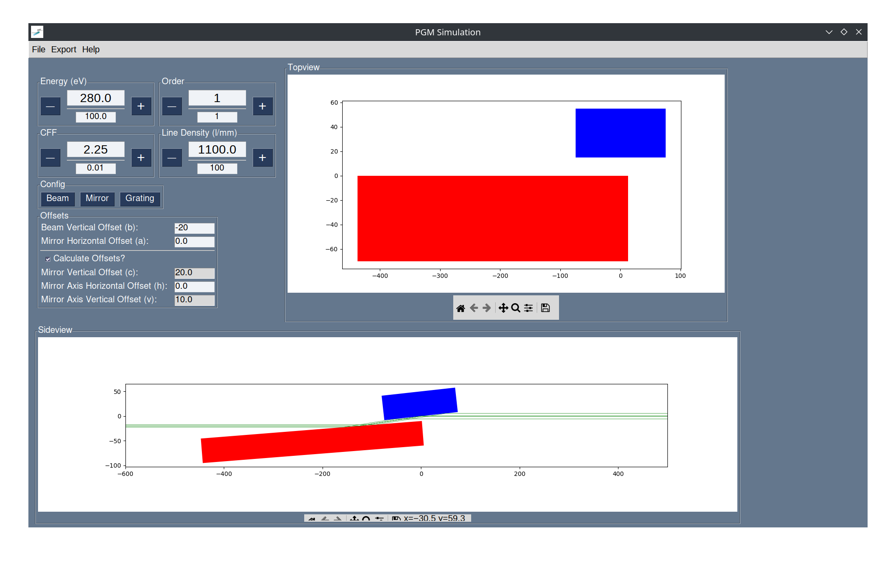
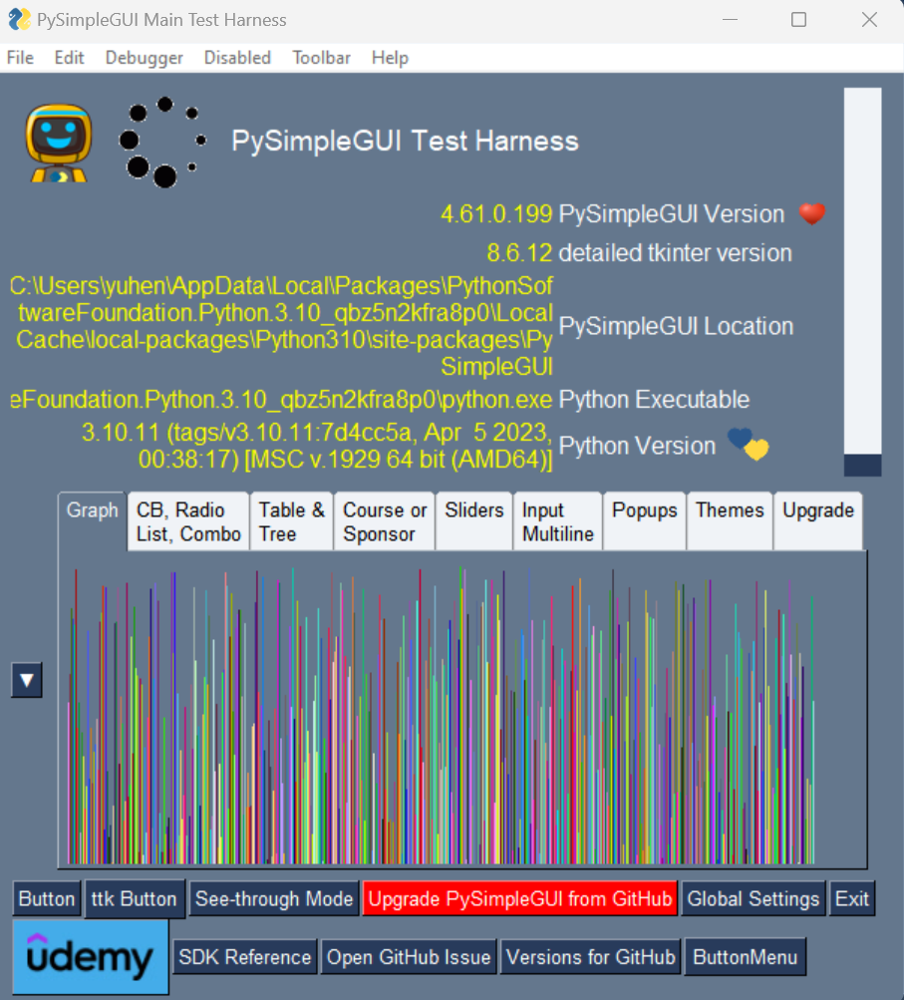

# PGM-Components Package

The pgm-components package provides the class PGM for use in simple ray tracing calculations.

The package also contains a linear algebra library for simple manipulation of 3D geometrical objects. These are provided by geometry_elements.py

See documentation html for more details.

Documentation located in ./docs/pgm-components as html files.

Picture of a setup is shown below:



## Installation Instructions

To install all required packages:

`pip install requirements.txt`

PySimpleGUI needs to be updated to the latest development version. This is done by issuing the following command:

`python -m PySimpleGUI.PySimpleGUI upgrade`

or

open an interactive python session (i.e. conda prompt)

```
>>> from PySimpleGUI import main
>>> main()
```
which should bring up the test harness:



and click the red button labelled "Upgrade PySimpleGUI from GitHub"

then click yes.

