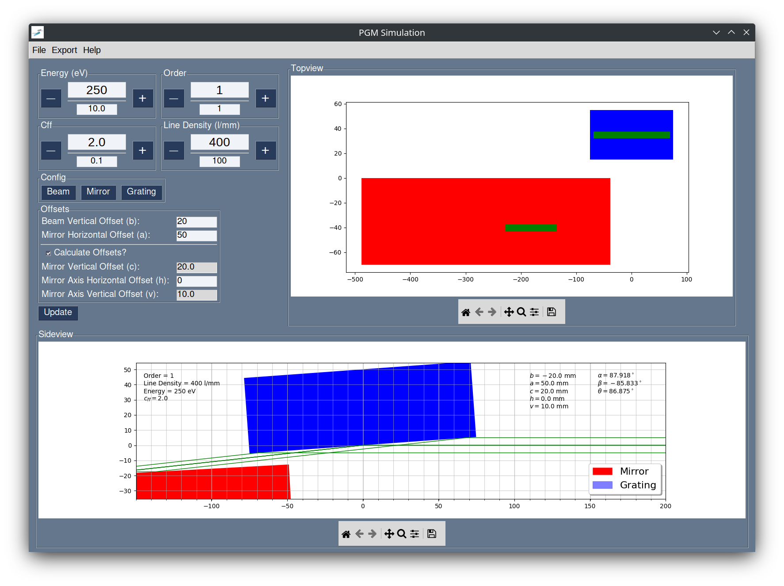

# PGM-Components Package
[](https://pgmcomponents.readthedocs.io/en/latest/?badge=latest)
[](https://github.com/patrickwang27/pgmcomponents/releases)


The pgm-components package provides the class PGM for use in simple ray tracing calculations.

The package also contains a linear algebra library for simple manipulation of 3D geometrical objects. These are provided by geometry_elements.py


Picture of a setup is shown below:



## Installation Instructions

To install, download the latest [release](https://github.com/patrickwang27/pgmcomponents/releases) and run the following command in the directory containing setup.py:

```bash
pip install pgmcomponents-some-version.tar.gz
```
To run the GUI:
```bash
python -m pgmcomponents.gui.main
```
or
```bash
pgm-gui
```

